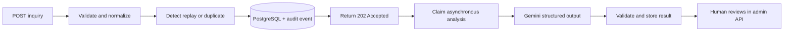

# Customer Inquiry Automation Backend

A demonstration Fastify API that accepts customer inquiries, stores them in
PostgreSQL, uses Gemini to classify and summarize them, and prepares an optional
reply draft for an authenticated administrator to review.

The application **never sends a reply automatically**. AI output is validated by
the backend and every resulting action remains subject to human review.

> Demo notice: use synthetic data only. Customer fields are stored as plaintext
> and inquiry content is sent to the configured AI provider.

## Application flow



1. `POST /api/v1/inquiries` strictly validates and normalizes the request.
2. The service checks an optional source reference for idempotency and compares
   a normalized fingerprint with recent inquiries for duplicate detection.
3. The inquiry and its audit event are stored transactionally, then the API
   returns `202 Accepted`.
4. A same-process runner claims the inquiry and sends it to the configured
   analysis provider with the active versioned company prompt.
5. The provider response must satisfy the local Zod schema before classifications,
   extracted facts, risk flags, and an optional reply draft are stored.
6. Authenticated admin endpoints expose the result for human review.

## Project organization

```text
src/
  app.ts                    composition root and plugin registration
  server.ts                 process startup and graceful shutdown
  config/                   validated environment configuration
  modules/
    inquiries/              public intake, normalization, duplicate detection
    analysis/               provider interface, Gemini adapter, workflow, schema
    auth/                   admin login, sessions, cookies, and CSRF
    admin/                  inquiry list/detail read models
    settings/               immutable company-prompt versions
    health/                 liveness and database readiness
  plugins/                  database, security, Swagger, and error handling
  shared/                   shared application errors
prisma/                     schema and committed migrations
tests/                      integration, workflow, provider, and schema tests
```

Routes handle HTTP concerns, services contain application rules, and repositories
own Prisma queries. `src/app.ts` is the composition root, so concrete dependencies
are selected at the application edge rather than inside domain workflows.

## Requirements

- Node.js 24
- npm
- Docker Desktop or another Docker installation with Compose
- Optional: a Gemini API key to enable analysis

Docker is used only for PostgreSQL. The backend runs directly in Node.js for a
shorter development feedback loop.

## Quick start

From the repository root:

```powershell
Copy-Item .env.example .env
npm install
npm run db:start
npm run db:deploy
npm run dev
```

On macOS/Linux, replace the first command with:

```bash
cp .env.example .env
```

`npm run db:start` automatically pulls `postgres:17-alpine` when necessary,
creates the named data volume, starts PostgreSQL on `127.0.0.1:5433`, and waits
for its health check. `npm run db:stop` stops it without deleting its data.

The API is then available at:

- API: `http://localhost:3000`
- Swagger UI: `http://localhost:3000/documentation`
- OpenAPI JSON: `http://localhost:3000/documentation/json`
- Liveness: `http://localhost:3000/health/live`
- Database readiness: `http://localhost:3000/health/ready`

The committed demo administrator is:

```text
Username: admin
Password: demo-admin-password
```

Set `GEMINI_API_KEY` in `.env` to enable AI analysis. Without a key, the API still
accepts and stores inquiries, which remain in `RECEIVED` status.

## AI model and provider changes

Changing the Gemini model requires no code change:

```dotenv
GEMINI_MODEL=gemini-3.1-flash-lite
```

Provider-specific code is isolated in `gemini.provider.ts`. The rest of the
workflow depends on the `AnalysisProvider` interface. To use another AI vendor:

1. Implement `AnalysisProvider` in a new adapter.
2. Return validated `AnalysisOutput` values.
3. Select the adapter in `analysis.factory.ts`.

The company-specific prompt is separately editable through the admin settings
endpoint. Each update creates an immutable version, and every analysis records
which version it used.

## Endpoints

| Method | Path | Access | Purpose |
| --- | --- | --- | --- |
| `GET` | `/health/live` | Public | Process liveness |
| `GET` | `/health/ready` | Public | PostgreSQL readiness |
| `GET` | `/health` | Public | Alias of readiness |
| `POST` | `/api/v1/inquiries` | Public, rate-limited | Submit an inquiry |
| `POST` | `/api/v1/auth/login` | Public, rate-limited | Create an admin session |
| `GET` | `/api/v1/auth/session` | Session cookie | Restore the admin session and CSRF token |
| `POST` | `/api/v1/auth/logout` | Session + CSRF | Revoke the session |
| `GET` | `/api/v1/admin/inquiries` | Session cookie | Filtered, sorted inquiry list |
| `GET` | `/api/v1/admin/inquiries/:id` | Session cookie | Inquiry, analysis, duplicate, and audit detail |
| `GET` | `/api/v1/admin/settings/ai` | Session cookie | Read the active company prompt |
| `PUT` | `/api/v1/admin/settings/ai` | Session + CSRF | Create and activate a prompt version |

Swagger contains the request/response schemas and query parameters. After login,
browser clients send the signed `HttpOnly` cookie automatically. State-changing
admin requests also send the returned CSRF token in `x-csrf-token`.

## Useful commands

| Command | Purpose |
| --- | --- |
| `npm run dev` | Start the TypeScript development server with reload |
| `npm run db:start` | Create/start PostgreSQL and wait until healthy |
| `npm run db:status` | Show the Compose database status |
| `npm run db:stop` | Stop PostgreSQL while retaining its volume |
| `npm run db:deploy` | Apply all committed Prisma migrations |
| `npm run db:migrate -- --name <name>` | Create a development migration |
| `npm run db:studio` | Open Prisma Studio |
| `npm run ai:smoke` | Make one real Gemini request using `.env` configuration |
| `npm run check` | Type-check, run all tests, and build |
| `npm start` | Run the compiled server after `npm run build` |

## Deliberate demo limitations

- The published admin credential demonstrates session mechanics, not private
  access control.
- Inquiry data is plaintext and must be synthetic.
- AI jobs and rate-limit state are process-local; this is suitable for the demo,
  not for horizontally scaled or guaranteed processing.
- Docker Compose starts only PostgreSQL; no database backups or production
  deployment configuration are included.
- AI suggestions are never sent or acted on automatically.
